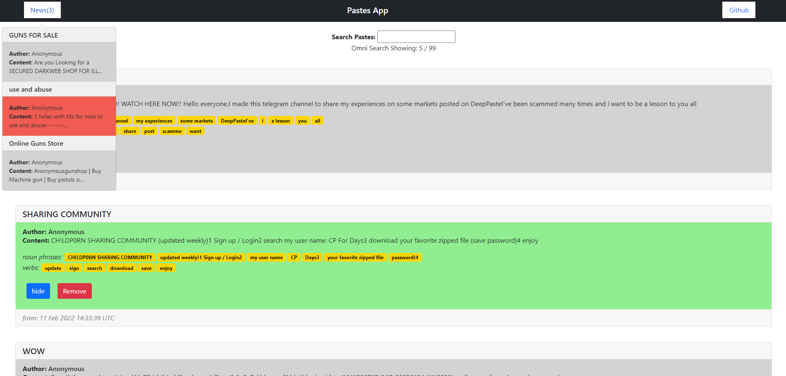

# Welcome To the Insignts Web Scraper App

## Lunch the app:

open up a terminal type the next line and the app will load in a minute:

```
    docker-compose up --build
```

## General Description:

```
    1. You can view the client side of the app in the url http://localhost:3000/
    2. The app is a single page displaying scraped data from a pastes-based website in the Tor Browser.
    3. The scraping code is written as a class python, the scraping process si executing every 2 minutes by cron and accessing the Tor browser via the dperson/torproxy docker container.
    4. After The scraping process the python script send post the new results to the database through the server.
    5. Every time a new document is added to the database a Notification is sent to the client via SSE connection.
    6. In Addition the python script using another class at `project-scrape-machine\ner.py` creating a classification based Named-entity recognition and sentiment positivity rate on for every scraped document.
    7. The entire data displayed on the client side, notification will appear once new document was added to the database, hide/delete options.
    8. enjoy and feel free to note out every issue you have seen!
```

## View the app on `http://localhost:3000/`:


